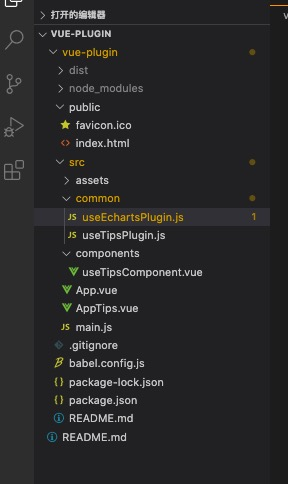

# 插件理论简介
- 插件通常用来为 Vue 添加全局功能
- Vue.use必须在new Vue之前使用
- Vue.use(MyPlugin, { someOption: true })；意思是创建一个名字叫MyPlugin的插件，然后默认调用MyPlugin插件的install方法，相当于MyPlugin.install(Vue，{ someOption: true })；install的第一个参数默认是全局的Vue实例，第二个参数是传递的自定义参数。后面可以通过在MyPlugin.install的方法中，给Vue实例定义全局的公共属性。

# 目录结构




#  vue插件之echarts封装

## 1.1 demo1
- 使用vue封装echarts插件
- install: function (Vue, options)的第二个参数是Vue.use(useEchartsPlugin, option)传进去的。
- 项目目录结构

```js
// useEchartsPlugin.js
import echarts from 'echarts'
export const useEchartsPlugin = {
    install: function (Vue, options) {
        Vue.component('echart', {
            mounted () {
                var myChart = echarts.init(document.querySelector('.echarts'));
                myChart.setOption(options);
            },
            render () {
                return (
                    <div class="echarts" style={{ width: '600px', height: '400px' }}>
                    </div>
                )
            }
        })
    }
}
```

```vue
// App.vue
<template>
  <div id="app">
    <echart></echart>
  </div>
</template>

<script>

export default {
  name: "App",
};
</script>

```
```js
import Vue from "vue";
import App from "./App.vue";
import { useEchartsPlugin } from './common/useEchartsPlugin'
Vue.config.productionTip = false;

// 指定图表的配置项和数据
var option = {
  title: {
    text: 'ECharts'
  },
  tooltip: {},
  legend: {
    data: ['销量']
  },
  xAxis: {
    data: ["衬衫", "羊毛衫", "雪纺衫", "裤子", "高跟鞋", "袜子"]
  },
  yAxis: {},
  series: [{
    name: '销量',
    type: 'bar',
    data: [5, 20, 36, 10, 10, 20]
  }]
};

Vue.use(useEchartsPlugin, option)

new Vue({
  render: h => h(App)
}).$mount("#app");
```
## 1.2 demo2
- 组件属性传参
```js
// main.js
import Vue from "vue";
import App from "./App.vue";
import { useEchartsPlugin } from './common/useEchartsPlugin'
Vue.config.productionTip = false;

Vue.use(useEchartsPlugin)

new Vue({
  render: h => h(App)
}).$mount("#app");
```

```vue
// App.vue
<template>
  <div id="app">
    <echart :optionProp="option"></echart>
  </div>
</template>
<script>
export default {
  name: "App",
  data () {
    return {
      option: {
        title: {
          text: 'ECharts 入门示例'
        },
        tooltip: {},
        legend: {
          data: ['销量']
        },
        xAxis: {
          data: ["衬衫", "羊毛衫", "雪纺衫", "裤子", "高跟鞋", "袜子"]
        },
        yAxis: {},
        series: [{
          name: '销量',
          type: 'bar',
          data: [5, 20, 36, 10, 10, 20]
        }]
      }
    }
  }
};
</script>


```

```js
// useEchartsPlugin.js
import echarts from 'echarts'
export const useEchartsPlugin = {
    install: function (Vue) {
        Vue.component('echart', {
            mounted () {
                var myChart = echarts.init(document.querySelector('.echarts'));
                myChart.setOption(this.optionProp);
            },
            props: {
                optionProp: {
                    type: Object,
                    required: true
                }
            },
            render () {
                return (
                    <div class="echarts" style={{ width: '600px', height: '400px' }}>
                    </div>
                )
            }
        })
    }
}
```
# vue插件之toast封装

```js
// useTipsPlugin.js
import useTipsComponent from '../components/useTipsComponent.vue'
export const useTipsPlugin = {
    install: function (Vue) {
        const useTipsConstructor = Vue.extend(useTipsComponent)
        this.initParam()
        Vue.prototype.$toast = function (options) {
            const propsData = options
            let instance = new useTipsConstructor({ propsData })
            document.querySelector('body').appendChild(instance.$mount().$el)
        }
    },
    initParam () {
        console.log('xxx');
    }
}
```

```vue
//useTipsComponent.vue
<style lang="css" scoped>
#tips {
  width: 200px;
  height: 200px;
  background-color: skyblue;
  margin: 100px auto;
  text-align: center;
}
</style>
<template>
  <div id="tips" @click="btnClick" v-if="isShow">
    <p>{{ msg }}</p>
    <p>{{ tipType }}</p>
  </div>
</template>
<script>
export default {
  data () {
    return {
      isShow: true
    }
  },
  props: {
    msg: {
      type: String,
      required: true,
      default: '成功'
    },
    tipType: {
      type: String,
      default: 'success'
    }
  },
  methods: {
    btnClick () {
      this.isShow = false
    }
  }

}
</script>

```

```vue
// AppTips.vue
<template>
  <div id="app"></div>
</template>

<script>
export default {
  name: "App",
  mounted () {
    this.$toast({
      msg: '成功',
      tipsType: 'success'
    })
  }
};
</script>
```
```js
// main.js
import Vue from "vue";
import AppTips from "./AppTips.vue";
import { useTipsPlugin } from "./common/useTipsPlugin.js";

Vue.use(useTipsPlugin)
new Vue({
  render () {
    return (
      <AppTips />
    )
  }
}).$mount("#app");

```