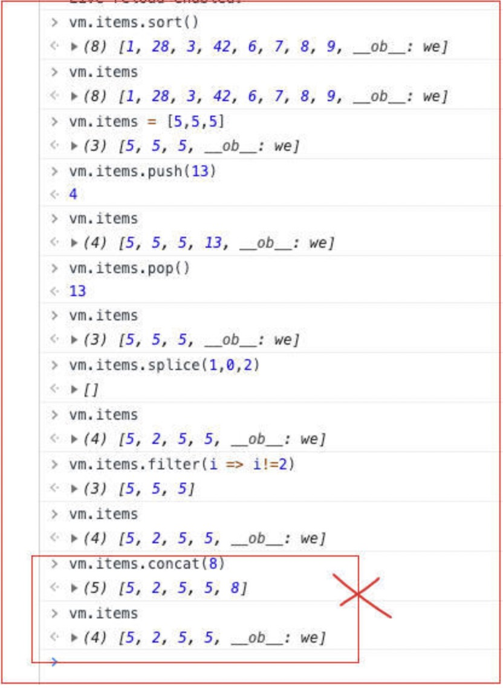

https://juejin.im/post/6844904154570162189


# 数组响应式

## 1.基本简介

arr[i] = xxx和arr.length = len：这两种方式都不会立刻触发响应式
```js
push pop shift unshift splice sort revcerse 或者直接给数组赋值等都会触发响应式
concat、filters、slice等等不对数组本身造成变化的都不会出发响应式
concat会返回新数组，不对原有数组操作
```



```js
// 示例1：
items: [
  { name: "a", age: 10 },
 { name: "b", age: 5 }
]
vm.items[0].age =20    // 会触发渲染
items: [1, 2]   vm.items[0]=99     // 不会触发渲染,但是值在内存中，如果有其他的渲染，那么这个内存的值会被一起渲染出去
vm.items.push(6)             // 99 2 6
```
## ## 2. 通过set实现数组下标响应式
```js
// 方式1：
vm.$set(vm.items, indexOfItem, newValue)
//vm.$set(数组名字, 改变的索引位置, 需要更改的值)
//this.$set(arr,1,'我想要不要被改变')

// 方式2：
Vue.set(vm.items, indexOfItem, newValue)
//Vue.set(数组名字, 改变的索引位置, 需要更改的值)
// Vue.set(arr,1,'我想被改变')
```
# 对象响应式
## 1. 基本简介

Vue不能检测对象属性的添加、删除（仅此而已，可直接对该对象重新赋值、修改该对象或内层对象的属性）

也就是说已经有了一个对象，如果我们手动给对象增加属性，或者删除属性，那么vue检测不到变化。

```js
// 示例1：
items: {
    name: "xiaomei",
    age: 18,
    habby: {}
}

vm.items.habby.a = 'AA'     // 不会触发重渲染, 但是值在内存中
vm.items.age = 20            // 触发重渲染，并且将habby.a在内存中的值也渲染了
// 删除age或者增加新属性都不会触发冲渲染
```
## 2. 通过set实现对象响应式
```js
方法一：Vue.set(对象, 对象属性, 属性值)
方法二：this.$set(对象, 对象属性, 属性值)
eg：this.$set(item, 'taskList', [1,2,3])
item: {
  taskList: [1,2,3]
}
```

# Vue.delete()&this.$delete()
一般我们删除对象某个属性，使用`delete obj.xx`，这种删除操作不会触发响应式，但是如果我们需要删除操作是响应式的，可以使用
```js
Vue.delete(obj, 'key')
或者
this.$delete(obj, 'key')
```