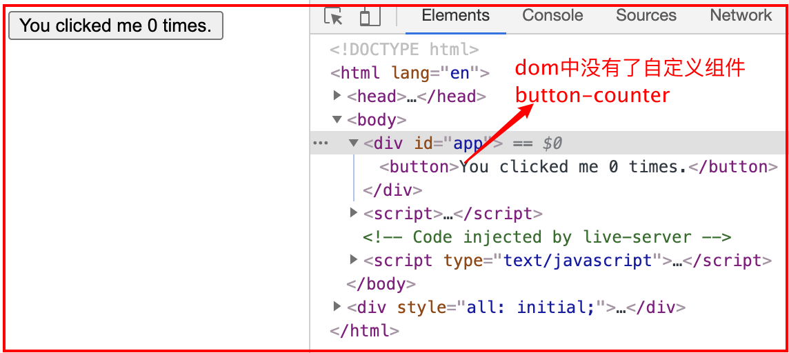

## 1. Vue.extend(options)

- ***参数***：options是个object
- ***作用***：使用基础 Vue 构造器，创建一个“子类”。参数是一个包含组件选项的对象；**`data` 选项在 `Vue.extend()` 中必须是函数**。

```html
<script src="https:cdn.jsdelivr.net/npm/vue"></script>
<div id="mount-point"></div>
<script>
  // 创建构造器
  var VmSon = Vue.extend({
    template: '<p>{{firstName}}--{{lastName}}</p>',
    // 备注： 在Vue.extend中data必须是函数
    data: function(){
      return {
        firstName: 'xu',
        lastName: 'xiaomei',
      }
    }
  })
  
  // 将创建的新vue实例挂载到元素上
  new VmSon().$mount('#mount-point')  // 备注：发现Id为mount-point的div ,是直接被template的p元素替代了，dom中没有Id为mount-point的div
</script>

// 结果展示如下
<p>xu--xiaomei</p>
```

## 2. Vue.use()


## 3. Vue.component()

### 3.1 基本介绍

- ***参数***：Vue.component（自定义组件名，对象或者扩展构造器）
  - `{string} id`
  - `{Function | Object} [definition]`

```js
// 方式1：注册组件，传入一个扩展过的构造器
Vue.component('my-component', Vue.extend({ /* ... */ }))

// 方式2：注册组件，传入一个选项对象 (自动调用 Vue.extend)
Vue.component('my-component', { /* ... */ })

// 方式3：获取注册的组件 (始终返回构造器)
var MyComponent = Vue.component('my-component')
```

- ***注意点***：
  - 组件是可复用的vue实例，所以和vue接受相同的选项——如`data、computed、watch、methods以及生命周期钩子函数` ，仅有的例外是像 `el` 这样根实例特有的选项。（不使用el 是因为component创建出来的组件是可复用的组件，哪个vue实例需要，就在哪个vue实例的el指定的元素范围内使用即可）
  - 自定义组件的`data必须是一个函数`，因为每个`button-counter`组件实例需要维护一份各自返回对象的独立拷贝，这样每个计数器的值才不会相互影响。
- ***基本用法***：注册或获取全局组件

```html
<!-- 示例1：基本用法 -->
<body>
  <div id="app">
    <button-counter></button-counter>
  </div>
  <script>
    Vue.component("buttonCounter", {
      data: function () {
        return {
          count: 0,
        };
      },
      template:
      '<button v-on:click="count++">You clicked me {{ count }} times.</button>',
    });
    var vm = new Vue({
      el: "#app"
    });
  </script>
</body>

<!-- 
问题：为什么自定义组件的data必须是一个函数，并且返回一个对象？
解释：如上述示例1，如果此时要求3个计数器组件 button-counter，
-->
```



### 3.2 组件创建的方式

1. 原始构造器创建方式：`Vue.extend（）`
2. 语法糖创建组件方式：`Vue.component（组件名， {}）`

```html
<!-- 原始构造器方式创建全局组件 -->
<body>
	<div id="app">
		<!-- 3. 在vue实例范围内使用组件cpn -->
		<cpn></cpn>
		<cpn></cpn>
	</div>
	<script>
		// 1. 创建组件构造器
		var cpnConstruct = Vue.extend({
			template: `<h1>hello</h1>`,
		});
    
		// 2. 借助组件构造器注册组件cpn
		Vue.component("cpn", cpnConstruct);

		var vm = new Vue({
			el: "#app",
			data: {
				message: "hello Vue",
			},
		});
	</script>
</body>


<!-- 原始构造器方式创建局部组件 -->
<body>
	<div id="app">
		<cpn></cpn>
		<cpn></cpn>
	</div>
	<script>
		// 1. 创建组件构造器
		var cpnConstruct = Vue.extend({
			template: `<h1>hello vue</h1>`,
		});

		var vm = new Vue({
			el: "#app",
			data: {
				message: "hello Vue",
			},
      // 2. 直接在components属性中注册组件名 cpn, 组件构造器cpnConstruct
			components: {
				'cpn': cpnConstruct,
			}
		});
	</script>
</body>
```

```html
// (推荐)语法糖创建组件 Vue.component('组件名', 对象)；其实这里的对象构造组件时还是会调用Vue.extend
<div id="app">
  <button-counter></button-counter>
</div>

Vue.component("button-counter", {
		template: `<h1>hello vue</h1>`,
	}
);
var vm = new Vue({
  el: "#app"
});
```


## 4. Vue.set()

- ***参数***：`Vue.set(Object|Array, propertyName/index, value)`
  - `{Object | Array} target`
  - `{string | number} propertyName/index`
  - `{any} value`
- **返回值**：设置的值。

- ***作用***：用于向响应式对象上添加或者修改 property，并确保这个新 property 同样是响应式的，且触发视图更新。注意对象不能是 Vue 实例或者 Vue 实例的根数据对象。

```html
<!-- 示例1：通过数组下标修改数组，是不会触发视图渲染的。但是内存中vm.arrs[1]的值已经被修改，只是没有触发视图渲染-->
<body>
  <div id="app">
    <ul>
      <li v-for="item of arrs">{{item}}</li>
    </ul>
    <button onclick="add()">add</button>
  </div>
  <script>
    add = () => {
      vm.arrs[1] = "ddd";		// 备注：这里通过数组下标修改数组，是不会触发视图渲染的
    };
    var vm = new Vue({
      el: "#app",
      data() {
        return {
          arrs: ["aa", "bb", "cc"],
        };
      },
    });
  </script>
</body>

<!-- 示例2：使用Vue.set强制响应式属性触发视图渲染 -->
add = () => {
    Vue.set(vm.arrs, 1, 'ee');
};
```

```html
<!-- 示例3：可以使用在data中增加一个变量的方式，修改变量进而触发视图渲染将data中的所有重新渲染一次，这时通过数组下标的形式修改的数组也会被渲染 -->
<body>
  <div id="app">
    <ul>
      <li v-for="item of arrs">{{item}}</li>
    </ul>
    <p>{{count}}</p>	<!-- 备注这里必须渲染count才可以触发vm的整个data渲染包括数组的渲染，如果只是改变count，但是不渲染count那么是不会触发响应式的试图更新的 -->
    <button onclick="add()">add</button>
  </div>
  <script>
    add = () => {
      vm.arrs[1] = 'gg';
      outData.count++;
    };
    var outData = {
      count: 1,
      arrs: ['aa', 'bb', 'cc']
    }
    var vm = new Vue({
      el: "#app",
      data: outData,

    });
  </script>
</body>
```

## 5. Vue.delete()

一般我们删除对象某个属性，使用`delete obj.xx`，这种删除操作不会触发响应式，但是如果我们需要删除操作是响应式的，可以使用
```js
Vue.delete(obj, 'key')
或者
this.$delete(obj, 'key')
```


## 6. Vue.nextTick()


## 7. Vue.filter()


## 8. Vue.directive()
- [Vue.directive](https://cn.vuejs.org/v2/api/#Vue-directive)
