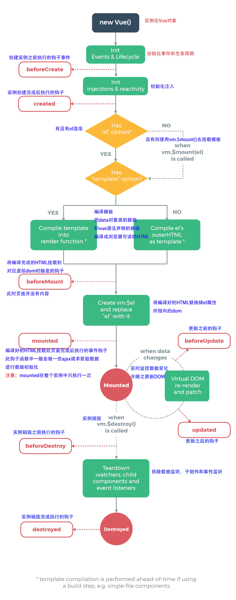

## 1. vue组件生命周期图

### 1.1  vue组件官方生命周期图


### 1.2 vue生命周期解析




## 2. 组件生命周期函数

-  刚初始化了一个空的实例对象, 这时候只有默认的一些生命周期函数和默认事件, 其他都未创建。
- 如果要调用 methods 中的方法, 或者操作 data 中的数据, 最早只能在 created 生命周期函数中操作

```js
// 1. 实例创建阶段
new Vue({
    el: "#app",
    // 在beforeCreate中,data和methods中的数据都还没有初始化
    beforeCreate () {}, 	// 表示实例完全被创建之前, 会执行这个函数
    // 在created中,data和methods中的数据都已经初始化好了
    created () {} 				// 表示实例被创建之后, 会执行这个函数
  
})

// 承接备注：查看Vue生命周期图例, 这里表示Vue开始编译模板, 把Vue代码中的那些指令进行执行, 最终在内存中生成一个编译好的最终模板字符串, 然后把这个字符串渲染为内存中的DOM,此时, 只是在内存中渲染好了模板, 并没有把模板挂载到真正的页面中。

```

```js
// 2. 运行期间：组件挂载和更新

new Vue({
    el: "#app",
    // 在beforeMounted执行时,页面中的元素还没有被真正的替换过来,只是之前写的一些模板字符串
    beforeMounted () {}, 	// 组件挂载之前 表示模板已经编译完成,但是还没有把模板渲染到页面中
    
    // 表示模板已经编译完成,内存中的模板已经真实的渲染到了页面中去,已经可以看到渲染好的页面了
    // 注意: mounted是实例创建期间的最后一个生命周期函数,当执行完mounted生命周期函数就表示,
    // 实例已经被完全创建好了,此时如果没有其他操作的话,这个实例就在内存中一动不动
    // 注意: 如果要通过某些插件操作页面上的DOM节点,最早要在mounted生命周期中操作
    mounted () {} 				// 组件挂载完成后
    
    // 上面的是组件的创建阶段,接下来进入组件的运行阶段
    // 在这个生命周期函数执行的时候,页面中显示的数据还是旧的,但是data中的数据是最新的,
    // 页面尚未和最新的数据保持同步
    beforeUpdate () {} 		// 表示当前界面还没有被更新,数据肯定被更新了
    // 查看Vue生命周期图例,这里表示先根据data中最新的数据在内存中重新渲染出一份最新的内存DOM树当最新的
    // 内存DOM树更新之后会把最新的内存DOM树重新渲染到真实的页面中去这时候就完成了数据从data(model层)
    // 到view(视图层)的更新
    updated () {} 				// 表示当前页面和数据保持同步了,都是最新的
})
```

```js
// 3. 组件销毁阶段
new Vue({
    el: "#app",
  	// 在这个生命周期函数执行的时候.实例身上所有的data和methods以及过滤器、指令等等都是可用状态,还没有真正的执行销毁的过程
    beforeDestroy () {}, 	// 表示组件即将被销毁之前，此时Vue实例以及数据指令等还是可以使用
  	// 在这个生命周期函执行的时候,组件中的data和methods以及过滤器、指令等等都已经不可用了
    destroyed(){} 				// 表示组件已经完全被销毁了，此时组件数据等已不可用
})
```

## 3. 全局组件和局部组件

### 3.1 全局组件

- ***全局组件***：`new Vue`构造函数外定义的就是全局组件，可以在其他的vue实例中都可以使用。

- ***注意点***：在使用Vue.component定义全局组件的时候，组件名称使用驼峰命名，则在引用组件的时候，需要把大写的驼峰改为小写的字母，同时两个单词之间使用` -` 连接

```html
<!---->
<body>
  <!-- 只要是vue实例的el指定的范围内都可以访问-->
  <div id="app">
    <button-counter></button-counter>
  </div>
  <div id="ppa">
    <button-counter></button-counter>
  </div>
  <!-- 这里不可以访问，因为component创建的组件必须在vue实例el指定的元素范围内使用才可以 -->
  <!-- 这里将Vue.component命名的组件 buttonCounter，在引用的时候需要写成 button-counter；最好都采用小写-连接 -->
  <button-counter></button-counter>
  <script>
    Vue.component("buttonCounter", {
      data: () => {
        return {
          count: 0,
        };
      },
      template:
      '<button v-on:click="count++">You clicked me {{ count }} times.</button>',
    });
    var vm1 = new Vue({
      el: "#app",
    });
    var vm2 = new Vue({
      el: "#ppa",
    });
  </script>
</body>
```

### 3.2 ***局部组件***

- ***局部组件***：在构造函数里面直接挂载在vue实例的`components`属性上；components是个对象，可以接受一组自定义的局部组件

```html
<body>
  <div id="app">
    <local-counter></local-counter>
  </div>
  <!-- 因为local-counter是局部组件，只能在vm1实例的el范围内使用 -->
  <div id="ppa">
    <local-counter></local-counter>
  </div>
  <script>
    // local-counter是自定义局部组件名，对应一个对象是其构造选项
    var vm1 = new Vue({
      el: "#app",
      components: {
        "local-counter": {
          template:
          '<button v-on:click="count++">You clicked me {{ count }} times.</button>',
          data: function () {
            return {
              count: 0,
            };
          },
        },
      },
    });
    var vm2 = new Vue({
      el: "#ppa",
    });
  </script>
</body>
```

## 4. 父子组件

- 父子组件关系的本质：只要一个组件在另一个组件的template中或者是实例的el绑定标签中。

```html
<!-- 父子组件关系一： -->
<body>
    <!-- div#app是父组件的模板 -->
    <div id="app">
        <cpn></cpn>
    </div>
    <script>
        // cpn的template是子组件cpn的模板，渲染的时候cpn组件会被整个cpn的template模板内容替换
        Vue.component('cpn', {
            template: `
                <div>
                    <h1>我是子组件</h1>
                </div>
            `,
        })
        var vm = new Vue({
            el: '#app',
            data() {
                return {
                    messageInfo: '我是父组件的message'
                }
            }
        })
    </script>
</body>

<!-- 父子孙的组件关系二： -->

<div id="app">
  <cpn1></cpn1>
</div>

<script>
  // 在vm实例的el绑定的div模板中使用cpn1组件，在cpn1组件的模板中使用cpn2组件
  Vue.component('cpn1', {
    template: `<div>
									<h1>我是cpn1标题1</h1>
									<cpn2></cpn2>
  						</div>`,
  })

  Vue.component('cpn2', {
    template: `<div>
									<h1>我是cpn2标题2</h1>
  							</div>`,
  })
  var vm = new Vue({
    el: '#app',
  })
</script>
```

```html
// 
<div id="app">
  <cpn1></cpn1>
</div>
<script>
  var cpnConstructor = Vue.extend({
    template: `<h2>我是cpn2标题2</h2>`
  })

  // var cpn2 = {
  //     template: `<h2>我是cpn2标题2</h2>`
  // };
  Vue.component('cpn1', {
    template: `<div>
                <h1>我是cpn1标题1</h1>
                <cpn2></cpn2>
  					</div>`,
    components: {
      cpn2: cpnConstructor // 这里可以放extend的构造器或者直接放cpn2定义的选项对象
    }
  })

  var vm = new Vue({
    el: '#app',
  })
</script>
```


## 5. 父子组件通信

- ***背景***：子组件虽然在父组件的模板中嵌套，但是子组件不能访问父组件data的数据，父组件也不能访问子组件的data数据；所以父子之间交互数据需要通信了。
- 最常见的应用就是：组件 A 在它的模板中使用了组件 B。它们之间必然需要相互通信：父组件可能要给子组件下发数据，子组件则可能要将它内部发生的事情告知父组件。
- ***注意***：

```js
1. Prop 是单向绑定的：当父组件的属性变化时，将传导给子组件，但是反过来不会。这是为了防止子组件无意间修改了父组件的状态，因为对于传递的引用类型的值，也就是说prop接受到的是对象或者数组，那么父子组件指向的同一块内存，子组件内部修改会影响父组件。
2. 子组件如果需要修改prop，则可以在子组件内部进行一份prop的拷贝
```


### 5.1 父组件向子组件传递

- 父组件向子组件传递方式：通过props属性
- 命名总结：HTML 特性是不区分大小写的。所以，当使用的不是字符串模板时，camelCase (驼峰式命名) 的 prop 需要转换为相对应的 `xxx-ccc (短横线分隔式命名)`；在js中使用驼峰式，html中使用短横线

```html
// 示例1：静态使用props，静态传值vue，注意属性时分隔符不能驼峰式
<div id="app">
  <cpn1 my-message="vue"></cpn1>
</div>
<script>
  Vue.component('cpn1', {
    // 声明props
    props: ['myMessage'],
    // 就像data一样，props里面的数据也可以在模板中使用，
    // 同样也可以在vm实例中通过 this.myMessage 来使用
    template: '<h1>hello {{myMessage}}</h1>',

  })
  var vm = new Vue({
    el: '#app',
  })
</script>

// hello vue
```

```html
// 动态props父组件传递数据到子组件

<body>
    <div id="app">
        <!-- myCpn自定义组件写成my-cpn  cpnList是子组件props中声明的属性写成cpn-list，接受父组件传递的属性-->
      	<!-- v-bind:cpn-list="list" 简写 :cpn-list="list" -->
      	<!-- cpn-list是子组件props中定义的属性cpnList，用于接收父组件传递来的list -->
        <my-cpn :cpn-list="list" :cpn-pers-info="persInfo"></my-cpn>
    </div>
    <script>
        Vue.component('myCpn', {
            // 在子组件的模板中使用子组件props中的属性
            template: `<div>
                        <h1>我是子组件myCpn</h1>
                        <h1>接收到的数据：{{cpnList}}</h1>
                        <h1>接收到的数据：{{cpnPersInfo}}</h1>
                    </div>`,
            props: ['cpnList', 'cpnPersInfo']
        });
        var vm = new Vue({
            el: "#app",
            data() {
                return {
                    list: ['数码', '家电', '旅行'],
                    persInfo: {
                        name: 'Bob',
                        age: 20
                    },
                }
            }
        });
    </script>
</body>
```


### 5.2 子组件向父组件传递

- 子组件向父组件传递数据是通过自定义事件

```html
<body>
  	<!-- 子组件模板 -->
    <template id="son">
        <div>
          	<!-- 1. 子组件通过点击事件触发事件函数 -->
            <button v-for="item of categories" @click="btnClick(item)">{{item.name}}</button>
        </div>
    </template>
  
  	<!-- 父组件模板 -->
    <div id="app">
      	<!-- 3. 父组件通过监听子组件的自定义事件item-click进行处理，注意自定义的事件的函数没有event对象，但是这里默认会将子组件的数据item带过去 -->
        <cpn-button @item-click="cpnClick"></cpn-button>
    </div>
  
    <script>
      	// 子组件
        Vue.component('cpnButton', {
            data() {
                return {
                    categories: [
                        { id: '1', name: '家电' },
                        { id: '2', name: '科技' },
                        { id: '3', name: '户外' },
                    ],
                }
            },
            template: '#son',
            methods: {
                btnClick(item) {
                 		// 2. 子组件将点击获取到的数据通过 this.$emit(自定义事件名，传递给父组件的数据)发射自定义事件；自定义事件名要小写短横线连接
                    this.$emit('item-click', item)
                }
            }
        })

      	// 父组件实例
        new Vue({
            el: '#app',
            methods: {
              	// 4. 父组件监听的自定义事件函数接收到子组件传递来的item数据 
                cpnClick(item) {
                    console.log("---", item)
                }
            }
        })
    </script>
</body>
```

## 6. 父子组件的访问

### 6.1 父访问子
- ***两种访问方式***：通过$children或者$refs
```js
1. this.$children：是一个包含所有子组件对象的数组
2. this.$refs：默认是`{}`，当在子组件上绑定ref属性时，this.$refs的结构就变成
`{ 绑定的ref属性: 对应的子组件 }`
```
```html
<!-- this.$children示例 -->
<body>
  <div id="app">
      <cpn></cpn>
      <button @click="btn">按钮</button>
  </div>
  <template id="cpn">
      <div>
          <h1>{{message}}</h1>
      </div>
  </template>
  <script>
      var vm = new Vue({
          el: "#app",
          data: {
              message: "我是父组件app",
          },
          methods: {
              btn() {
                  console.log(this.$children[0].message)
                  this.$children[0].show();
              }
          },
          components: {
              cpn: {
                  template: '#cpn',
                  data() {
                      return {
                          message: "我是子组件cpn",
                      }
                  },
                  methods: {
                      show() {
                          console.log(this.message);
                      }
                  }

              }
          }
      });
  </script>
</body>
```

```html
<!-- this.$refs示例： -->
<body>
    <div id="app">
        <cpn ref="cpnA"></cpn>
        <cpn ref="cpnB"></cpn>
        <button @click="showSon">按钮</button>
    </div>
    <template id="cpn">
        <div>
            <h1>{{message}}</h1>
        </div>
    </template>
    <script>
        var vm = new Vue({
            el: "#app",
            data() {
                return {}
            },
            methods: {
                showSon() {
                    console.log(this.$refs)
                    console.log(this.$refs.cpnA)
                    console.log(this.$refs.cpnB)
                }
            },
            components: {
                cpn: {
                    template: '#cpn',
                    data() {
                        return {
                            message: "我是子组件cpn",
                        }
                    },
                    methods: {
                        show() {
                            console.log(this.message);
                        }
                    }

                }
            }
        });
    </script>
</body>
```
### 6.2 子访问父
- ***this.$parent***：可以访问到父组件，但是不提倡这样做，这样会破坏子组件的复用性，比如在子组件中修改父组件A的name属性，但是其他B的组件引用这个子组件，B组件中并没有name属性；会导致没有解耦
- ***this.$root***： 会直接访问到根实例


