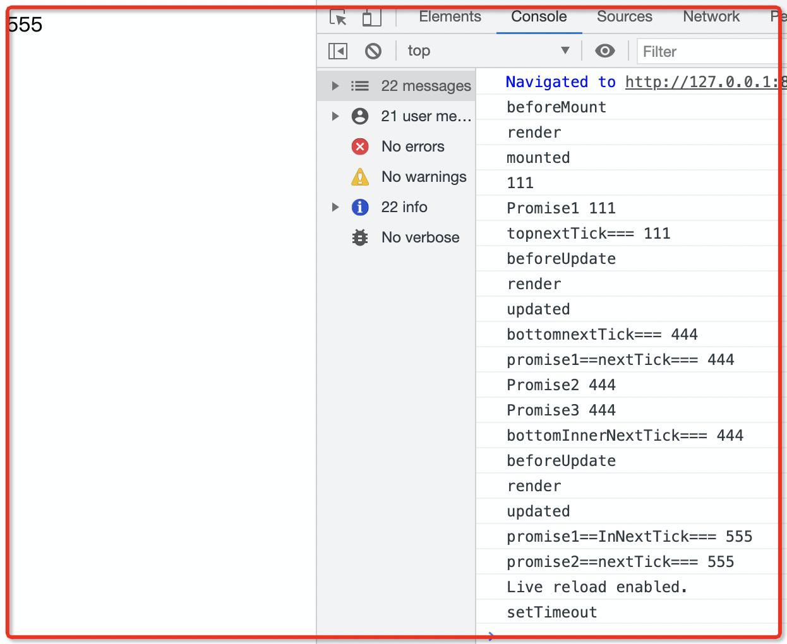

# vue异步更新机制

vue中更新dom是异步执行的，只要侦听到数据变化，Vue 将开启一个队列，并缓冲在同一事件循环中发生的所有数据变更。如果同一个 watcher 被多次触发，只会被推入到队列中一次。然后，在下一个的事件循环“tick”中，Vue刷新队列并执行实际 (已去重的) 工作（先缓冲，缓冲后再将多次触发属性的最后一次作为promise放入队列；而不是一上来就放队列）

关于上面这句话的理解：vue中数据的更新到dom是异步的，数据的异步更新可以理解成一个promise的微任务；并且对同一个属性值进行多次赋值时，只有最后一次赋值会作为一个promise微任务放到更新队列。

注意下一个事件循环的Tick有可能是在当前的Tick微任务执行阶段执行，也可能是在下一个Tick执行，主要取决于nextTick函数到底是使用Promise/MutationObserver还是setTimeout

***场景1结论***：dom异步更新，所谓的异步相当于一个promise微任务

```html
// 场景1：

<div id="example">{{message}}</div>
<script>
  var vm = new Vue({
    el: '#example',
    data: {
      message: '123'
    }
  })
  
	// 碰到这句时，把这句理解成一个promise放在promise队列
  vm.message = 'new message' // 更改数据

  Promise.resolve(100).then(value => {
    console.log("如果上面的赋值是相当于promise，那么这句输出结果应该是new message", vm.$el.textContent);		// 第二步输出：new message
  })
  console.log(vm.$el.textContent);	// 第一步输出：123
</script>

```

***场景2结论***：赋值改变响应式属性会被当做一个promise，并且执行的顺序也是跟正常promise队列的顺序一样先进先出

```js
//示例1：
var vm = new Vue({
  el: '#example',
  data: {
    message: '123'
  }
})

vm.message = 'new' // 更改数据

Promise.resolve(100).then(value => {
  console.log("测试第一次赋值", vm.$el.textContent);		// 第二步输出：new （因为vm.message = 'new' 先放进promise队列，所以先执行，所以本行输出数据已经改变为new）
})
console.log(vm.$el.textContent);		// 第一步输出：123


// 示例2：
var vm = new Vue({
  el: '#example',
  data: {
    message: '123'
  }
})

Promise.resolve(100).then(value => {
  console.log("测试第一次赋值", vm.$el.textContent);		// 第二步输出：123 （因为这里vm.message = 'new'这个promise在队列的第二位，所以还没执行，所以此时这里的输出还是123）
})

vm.message = 'new' // 更改数据
console.log(vm.$el.textContent);		// 第一步输出：123
```

***场景3结论***：场景3说明了异步更新的执行顺序和原理见代码下方总结

```html
// 示例1：
<div id="example">{{message}}</div>
<script>
  var vm = new Vue({
    el: '#example',
    data: {
      message: '123'
    }
  })

  vm.message = 'msg' // 更改数据

  Promise.resolve(100).then(value => {
    console.log("测试第一次赋值", vm.$el.textContent);		// 第二步输出：new
  })

  vm.message = 'new' // 更改数据
  console.log("==", vm.$el.textContent);		// 第一步123

  Promise.resolve(100).then(value => {
    console.log("测试第二次赋值", vm.$el.textContent);		// 第三步输出：new
  })
</script>


// 示例2：
<div id="example">{{message}}</div>
<script>
  var vm = new Vue({
    el: '#example',
    data: {
      message: '123'
    }
  })

  Promise.resolve(1).then(value => {
    console.log("xxx", vm.$el.textContent);		// 第二步输出：123
  })

  vm.message = 'msg' // 更改数据

  Promise.resolve(2).then(value => {
    console.log("测试", vm.$el.textContent);  // 第三步输出：new
  })

  vm.message = 'new' // 更改数据

  Promise.resolve(3).then(value => {
    console.log("fff", vm.$el.textContent);			// 第四步输出：new
  })
  
  console.log(vm.$el.textContent);			// 第一步输出：123
</script>


// 总结：场景3的示例1和2一起说明vue异步更新原理。以场景3的示例2简单说下流程：主流程顺序执行代码碰到promise1，把promise1放到微任务队列第一位，接着主线程继续执行同步代码，碰到vm.message = 'msg'，将vm.message = 'msg'作为promise放到任务队列第二位，并将vm.message属性放在缓冲区中，接着主线程继续执行同步代码发现promise2，将promise2放到微任务队列第三位，主线程继续执行同步代码，碰到 vm.message = 'new'，发现vm.message这个属性已经在缓冲区了，所以会把'new'这个值也缓存到缓冲区（但不会将vm.message = 'new'作为微任务放到微任务队列的），接着主线程继续执行同步代码，碰到promise3，将promise3放入微任务队列的第四位，接着主线程继续执行同步代码碰到console.log(vm.$el.textContent);	此时直接执行，则第一步输出123；主线程执行栈为空了，此时会把刚才在缓冲区的vm.message属性的值 'new' 赋值给微任务中排在第二位"vm.message = 'msg'",赋值后vm.message就等于'new'；然后主线程按照队列法则先进先出开始执行微任务队列的任务，第一位任务promise1输出xxx123，第二位任务"vm.message = 'new'" 渲染更新到div#example的dom节点上，第三位任务promise2输出 测试new（因为上一个任务已经将new更新到dom节点了）。第四位任务promise3输出 fff new。
主要注意的点是vue会把更新数据的异步任务按照主线程的同步代码执行正常放到队列，但是会将属性缓存到缓冲区，如果执行同步代码时再遇见则更新缓冲区的属性值，而不会再遇见时当做任务放入队列中；最后等到同步代码执行完毕后，会把缓冲区最终的值更新到微任务队列中的异步数据更新任务上， 然后开始从头到尾执行微任务队列。
最后圆满结束。
```


#  Vue.nextTick(callback)

#### 1. 简介

一般执行`vm.message = 'msg' // 更改数据`之后没办法立马更新dom，因为这更改数据的操作相当于一个promise了。如果我们想在更改完数据之后并且在其他同步代码之前需要进行一些操作，此时可以使用`Vue.nextTick(callback)`强制dom更新，

https://segmentfault.com/a/1190000012861862

```html
<!DOCTYPE html>
<html lang="en">

<head>
    <meta charset="UTF-8">
    <meta name="viewport" content="width=device-width, initial-scale=1.0">
    <title>Document</title>
    <script src="https:cdn.jsdelivr.net/npm/vue"></script>
</head>

<body>

    <div id="example"></div>
    <script>
        var vm = new Vue({
            el: '#example',
            data: {
                message: '111'
            },
            beforeMount() {
                console.log("beforeMount");
            },
            mounted() {
                console.log("mounted");
            },
            beforeUpdate() {
                console.log("beforeUpdate");
            },
            updated() {
                console.log("updated");
            },
            render: function (createElement, context) {
                console.log("render");
                return createElement(
                    'div',
                    {},
                    [this.message]
                );

            }
        })

        setTimeout(() => {
            console.log("setTimeout");
        }, 0)
        Promise.resolve().then(value => {
            console.log("Promise1", vm.$el.textContent);
            Vue.nextTick(() => {
                vm.message = '555'
                Vue.nextTick(() => {
                    console.log("promise1==InNextTick===", vm.$el.textContent);
                })
                console.log("promise1==nextTick===", vm.$el.textContent);
            })
        })

        Vue.nextTick(() => {
            console.log("topnextTick===", vm.$el.textContent);
        })

        vm.message = '222' // 更改数据

        Promise.resolve().then(value => {
            console.log("Promise2", vm.$el.textContent);
            Vue.nextTick(() => {
                console.log("promise2==nextTick===", vm.$el.textContent);
            })
        })

        Vue.nextTick(() => {
            // vm.message = '555'
            Vue.nextTick(() => {
                console.log("bottomInnerNextTick===", vm.$el.textContent);
            })
            console.log("bottomnextTick===", vm.$el.textContent);
        })

        vm.message = '333' // 更改数据

        Promise.resolve().then(value => {
            console.log("Promise3", vm.$el.textContent);
        })

        console.log(vm.$el.textContent);

        vm.message = '444'

    </script>
</body>

</html>
```



#### 2. 总结

> 前提：vue2.6版本下，nextTick作为promise被处理

1. vm.xxx = xxx被当做promise对待，具体处理方式见：https://juejin.im/post/6882727213708345352

2. vm.xxx = xxx会触发updated更新，更新之后第一时间会执行当前微任务队列中的nextTick
```js
// 比如微任务队列内容是：vm.xx=xxx、p1(p1-nextTick)、p2、nextTick1、p3、nextTick2.

p1(p1-nextTick)：表示p1这个promise回调中还包含一个nextTick
p2：表示p2是promise回调
nextTick1：是个nextTick回调
p3：表示p3是promise回调
nextTick2：是个nextTick回调

此时按照顺序执行`vm.xx=xxx`,触发beforeUpdate、render、updated，这时候接着执行nextTick1回调，然后执行nextTick2回调，然后再执行p1回调，并将p1回调中的p1-nextTick添加到微任务队列的末端，也就是p3的后面，这时候再执行p2，执行p3，然后执行p1-nextTick

```


# render渲染位置

结论：

- 组件挂载维度：beforeMount、render、mounted
- 数据更新维度：beforeUpdate、render、updated

```html
<div id="example">{{message}}</div>
<script>
  var vm = new Vue({
    el: '#example',
    data: {
      message: '111'
    },

    beforeMount() {
      console.log("beforeMount");

    },
    mounted() {
      console.log("mounted");
    },
    beforeUpdate() {
      console.log("beforeUpdate");
    },
    updated() {
      console.log("updated");
    },
    render: function (createElement, context) {
      console.log("render");
      return createElement(
        'div',
        {
          class: { 'my-class': true }
        },
        [this.message]
      );

    }
  })
</script>
```


# 任务和render渲染的关系

宏任务队列：A	B

微任务队列：a	b	c

执行顺序为：先加载A宏任务到执行栈，然后执行a，b，c这3个微任务，接着执行render渲染页面，之后加载B宏任务到执行栈。（注意：script(整体代码)**即一开始在主执行栈中的同步代码本质上也属于macrotask，属于第一个执行的task** ）

结论：微任务队列在render之前执行，浏览器的render渲染ui绘制会插在每个macrotask之间

